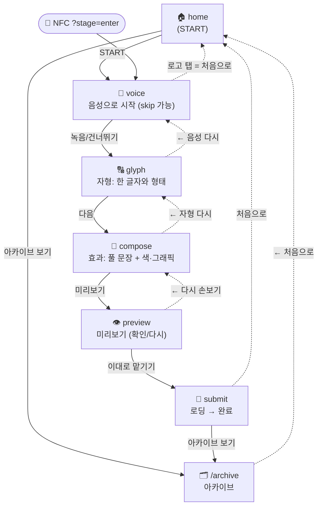
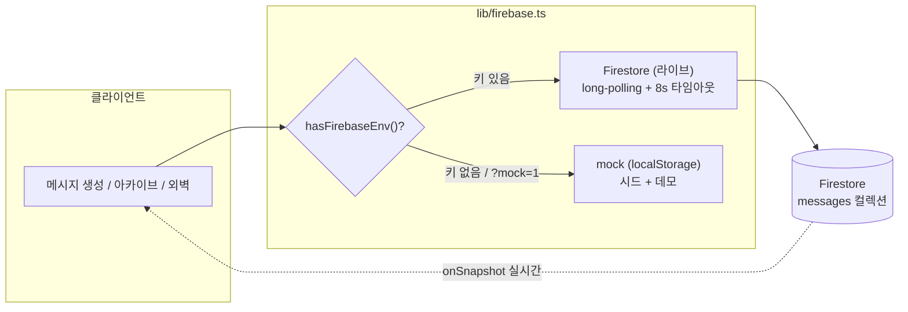

# MEGAFONT — IA 구조도 (현재 코드 기준)

> 2026-06-07 기준. `src/App.tsx` 라우팅 + 화면 상태머신, `src/lib/firebase.ts` 데이터 계층을 그대로 반영.

---

## 1. 한눈에 — 두 청중, 세 영역

```
                        ┌─────────────────────────────────────────┐
                        │              MEGAFONT 웹앱                │
                        └─────────────────────────────────────────┘
                                          │
        ┌─────────────────────────┬───────────────────────┬──────────────────────┐
        │                         │                       │                      │
   참여자(폰)                참여자/관객               운영자                   (공유)
   ───────────              ───────────              ───────────             ───────────
   메시지 만들기              아카이브 보기              외벽 출력               Firestore
   `/`                       `/archive`               `/wall`                 messages 컬렉션
   (발화 생성 플로우)          (지금까지의 발화)          관리자 `/admin`          (라이브 / mock 폴백)
```

- **참여자**: 폰으로 한 줄을 만들어 외벽에 올림.
- **관객**: 아카이브에서 지금까지 올라온 발화를 봄.
- **운영자**: `/wall`(설치 현장 프로젝션), `/admin`(목록 관리). 홈에는 노출 안 함 — URL 직접 접근.

---

## 2. 라우트 맵 (URL 레벨)

| 경로 | 화면 | 청중 | 비고 |
|:--|:--|:--|:--|
| `/` | 홈 → 발화 생성 플로우 | 참여자 | 화면 상태머신 진입 |
| `/?stage=enter` | (NFC 진입) 음성 단계로 바로 | 참여자 | 진행중 draft 있으면 미리보기로 복귀 |
| `/?stage=submit` | (NFC 재태그용) 전송 화면 | 참여자 | 하위호환 — 현재 플로우는 인앱 확인 사용 |
| `/archive` | 아카이브 (전체 발화 그리드) | 관객 | 홈·완료에서 링크 |
| `/wall` | 외벽 프로젝션 시뮬레이터 | 운영자 | 수평 다중 트랙, 12s emphasis |
| `/admin` | 관리자 목록 | 운영자 | 메시지 그리드 + id/메타 |
| `?mock=1` | (모든 경로) Firestore 대신 mock | 디버그 | "데모 모드로 보기" 버튼 |

---

## 3. 발화 생성 플로우 (홈 = `/` 안의 화면 상태머신)



- 실선 = 앞으로(주 동선), 점선 = 뒤로/탈출.
- 진행 상태는 `localStorage(megafont.draft.v1)`에 자동 저장 → NFC 재진입 시 미리보기로 복귀.

---

## 4. 단계별 입력/산출 (데이터가 쌓이는 순서)

```
voice    →  음성 4분류 → 폰트·무게 프리셋 (선택, 온디바이스 분석)
glyph    →  font / wght / tone(scaleX) / slnt / size   ── 샘플 글자 "가"로 조정
compose  →  text(≤60자) + paletteIdx(무드 5) + graphicIdx(자모 그래픽)
preview  →  위 전체를 합친 최종 ToneState 확인
submit   →  Firestore `messages`에 저장 → 완료
```

`ToneState = { font, tone, wght, slnt, size, paletteIdx, graphicIdx }` (+ `text`, `createdAt`)

---

## 5. 데이터 계층



- **쓰기**: `submit` → `addMessage` (서버 커밋 확인, 8s 캡 → 실패 시 에러)
- **읽기**: `archive`/`admin` = `listMessages` (8s 캡 + 캐시 폴백), `wall` = `subscribeMessages` (실시간)
- 키 없거나 `?mock=1` → mock 폴백 (폰 로컬, 공유 안 됨)

---

## 6. 청중별 접근 경로 요약

| 청중 | 들어오는 곳 | 할 수 있는 것 | 못 가는 곳(숨김) |
|:--|:--|:--|:--|
| 참여자 | `/`, NFC | 발화 생성, 아카이브 보기 | `/wall`·`/admin`(홈 링크 제거됨) |
| 관객 | `/archive` | 전체 발화 열람, 홈 가기 | — |
| 운영자 | `/wall`, `/admin` (URL 직접) | 외벽 출력, 목록 관리, 샘플 시드 | — |
