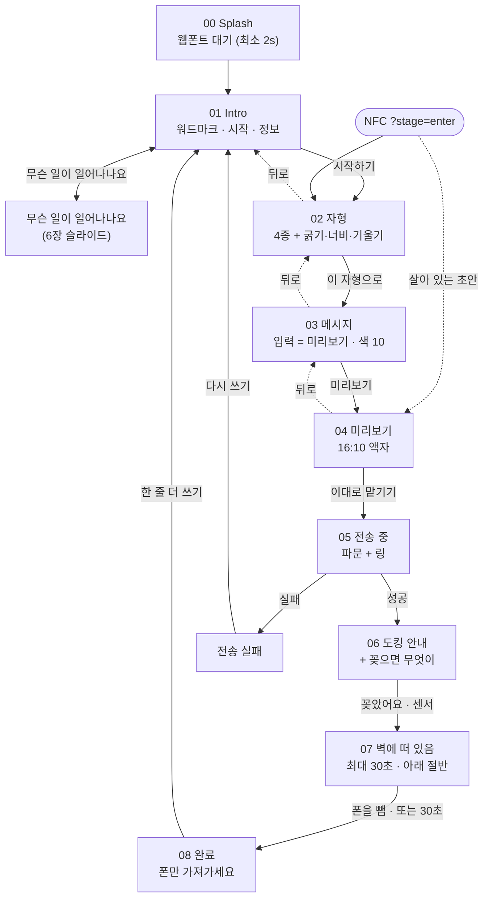

# MEGAFONT — IA 구조도 (현재 코드 기준)

> 2026-09-06 갱신. `src/App.tsx`의 라우팅과 화면 상태머신, `src/lib/firebase.ts`의
> 데이터 계층을 그대로 반영한다.

---

## 1. 한눈에 — 두 청중

```
                    ┌──────────────────────────────┐
                    │          MEGAFONT            │
                    └──────────────────────────────┘
                                  │
          ┌───────────────────────┴───────────────────────┐
          │                                               │
     참여자 (폰)                                   설치 · 운영
     ──────────                                    ──────────
     한 줄 만들어 벽에 올리기                       벽 출력  /wall
     `/`  00 → 08                                  목록 확인  /admin
                          │                              │
                          └──────────┬───────────────────┘
                                     │
                              Firestore  messages
                              (REST · mock 폴백)
```

관객이라는 세 번째 청중은 없다. 지나가다 벽을 읽는 사람은 앱을 열지 않는다 —
읽는 자리는 벽이지 화면이 아니다. (아카이브를 없앤 이유이기도 하다.)

---

## 2. 라우트 맵

| 경로 | 화면 | 청중 | 비고 |
|:--|:--|:--|:--|
| `/` | 00 → 08 발화 플로우 | 참여자 | 화면 상태머신 |
| `/?stage=enter` | 홈을 건너뛰고 **02 자형**부터 | 참여자 | NFC 태그가 여는 URL. 살아 있는 초안이 있으면 04로 복귀 |
| `/wall` | 벽 출력 | 설치 | 3트랙 풍경 + 도킹 시 강조(최대 30초) |
| `/admin` | 메시지 목록 | 운영 | id·메타 포함 |
| `?mock=1` | (모든 경로) localStorage 백엔드 | 개발 | Firestore를 건드리지 않는다 |

`/archive`와 `?stage=submit`은 제거됐다. 전자는 사흘 뒤 사라진다는 전제와
어긋났고, 후자는 06·07·08을 통째로 건너뛰는 구멍이었다.

---

## 3. 화면 상태머신

`App.tsx`의 `Screen` 타입이 그대로 이 그림이다. URL은 바뀌지 않는다.


```mermaid
flowchart TD
    SPLASH["00 Splash<br/>웹폰트 대기 (최소 2s)"]
    HOME["01 Intro<br/>워드마크 · 시작 · 정보"]
    INFO["무슨 일이 일어나나요<br/>(6장 슬라이드)"]
    GLYPH["02 자형<br/>4종 + 굵기·너비·기울기"]
    COMPOSE["03 메시지<br/>입력 = 미리보기 · 색 10"]
    PREVIEW["04 미리보기<br/>16:10 액자"]
    SENDING["05 전송 중<br/>파문 + 링"]
    DOCK["06 도킹 안내<br/>+ 꽂으면 무엇이"]
    ONWALL["07 벽에 떠 있음<br/>최대 30초 · 아래 절반"]
    DONE["08 완료<br/>폰만 가져가세요"]
    ERR["전송 실패"]

    SPLASH --> HOME
    HOME -->|시작하기| GLYPH
    HOME <-->|무슨 일이 일어나나요| INFO
    NFC(["NFC ?stage=enter"]) --> GLYPH
    NFC -.->|살아 있는 초안| PREVIEW

    GLYPH -->|이 자형으로| COMPOSE
    GLYPH -.->|뒤로| HOME
    COMPOSE -->|미리보기| PREVIEW
    COMPOSE -.->|뒤로| GLYPH
    PREVIEW -->|이대로 맡기기| SENDING
    PREVIEW -.->|뒤로| COMPOSE

    SENDING -->|성공| DOCK
    SENDING -->|실패| ERR
    ERR -->|다시 쓰기| HOME
    DOCK -->|꽂았어요 · 센서| ONWALL
    ONWALL -->|폰을 뺌 · 또는 30초| DONE
    DONE -->|한 줄 더 쓰기| HOME
```

**05부터는 뒤로 갈 수 없다.** 보낸 뒤에는 고칠 수 없다는 규칙이 화면 구조에도
그대로 있어야 해서다.

---

## 4. 단계별로 정해지는 값

```
02 자형     →  font, wght, tone(너비), slnt
03 메시지   →  text(60자), paletteIdx
04 미리보기 →  (확인만)
05 전송     →  Firestore로 write, 초안 삭제
```

`graphicIdx`는 항상 `-1`로 저장된다. 효과 기능은 걷어냈지만 옛 문서를 읽기
위해 스키마에는 남겨뒀다.

---

## 5. 데이터

### 저장되는 것

```ts
// Firestore  messages/{id}
{
  text: string,          // 최대 60자
  tone: {
    font, tone, wght, slnt, size,
    paletteIdx,          // 0..9
    graphicIdx           // 항상 -1
  },
  createdAt: number      // ms epoch
}
```

`expiresAt`은 쓰지 않는다. `/wall`이 읽을 때 `createdAt + STAY_MS`로 거른다.
`location`도 없다 — 익명이 이 프로젝트의 규칙이라서.

### 로컬

| 키 | 무엇 | 수명 |
|:--|:--|:--|
| `megafont.draft.v1` | 쓰다 만 초안 | **10분**. 광장의 공용 기기라 앞사람 문장이 남으면 안 된다 |
| `megafont.mock.messages.v1` | `?mock=1`일 때의 가짜 저장소 | 수동 삭제까지 |

### 벽 트리거

`control/display.showTrigger`가 `false → true`로 바뀌는 순간 `/wall`이 최신
메시지를 전면에 띄우고 값을 되돌린다. 물리 설치에서는 도킹 센서가
이 값을 쓴다.

---

## 6. 시간 상수

전부 [`src/lib/wall.ts`](../src/lib/wall.ts)에 있다. 화면 카피와 필터가 같은
숫자를 봐야 해서 한곳에 모았다.

| 상수 | 값 | 쓰이는 곳 |
|:--|:--|:--|
| `STAY_DAYS` / `STAY_MS` | 3일 | `/wall` 필터, 홈·정보·완료 카피 |
| `EMPHASIS_MS` | 30초 (상한) | `/wall` 강조, 07 카운트다운, 06 예고 |
| `WALL_W_M` × `WALL_H_M` | 2.4 × 1.5 m | 03·04 액자 비율, 정보 시트 |

---

## 7. 아직 비어 있는 자리

- **도킹 감지** — 06→07, 07→08이 버튼이다. 센서가 붙으면 두 전환만 갈아끼우면 된다
- **07 도중 이탈** — 앱과 벽은 이미 처리한다(`control/display.docked`가
  내려가면 벽이 강조를 접고 앱은 08로 간다). 다만 그걸 알리는 건 아직
  버튼이라, 말없이 뽑고 가버리면 30초 상한이 대신 끊는다
- **'짓궂은' 서체** — Sunflower가 '당당한'과 골격이 겹치고, 부제 '탈네모'와도 어긋난다. 사용자 테스트의 선결 조건
- **본체 방향** — 앱 카피의 '저 벽'은 본체가 벽을 보고 선다는 전제 위에 있다
- **관리자 삭제** — `/admin`은 읽기 전용
- **보안** — Firestore 규칙이 열려 있다. 출시 전 좁혀야 한다
